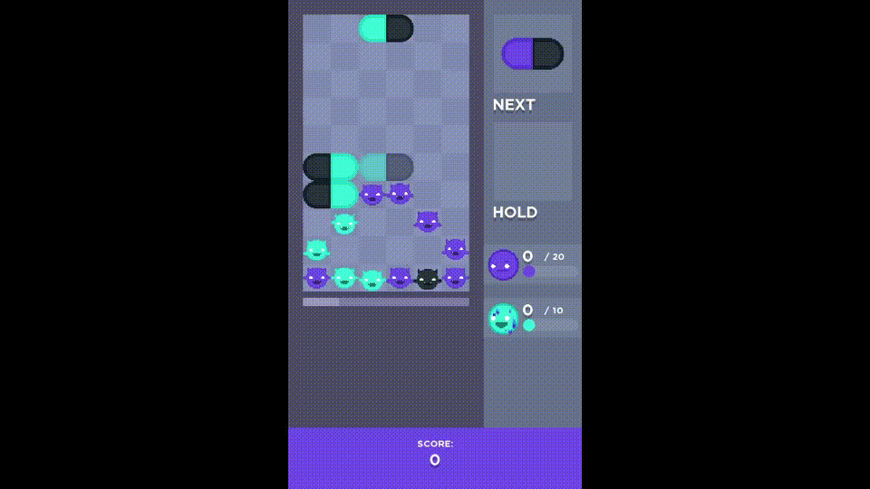

<!--suppress HtmlDeprecatedTag -->
<center>    

#  KAPS! 

</center>

A *'Dr. Mario'-like* colorful mini-game. Match the colored capsules and get rid of every germ in the grid ! 🧪

## LAUNCH THE GAME 🎮

⚠ You must have [**Java 11** or +](https://www.oracle.com/java/technologies/javase/jdk11-archive-downloads.html) installed to play the game.

#### WINDOWS

- Click on `kaps.exe`

#### LINUX

- Execute `./kaps.sh`

...or place yourself in the root directory, open a terminal and launch the command:

```sh
> java -jar bin/kaps-demo.jar
```

### COMMANDS ! ⌨

```sh
> ... -l [number1] [number2] ...
```

Launches a sequence of levels of n° `number`.  
If `number` is `?`, generates a random grid !

```sh
> ... -s [name]
```

Adds the sidekick of name `name` to the team before the level starts.

*More coming soon !*

## HOW TO PLAY 🕹

#### 💊 In-game

`⬅`, `➡` / `Q`, `D` : move the capsule **left/right**  
`⬆` / `Z` : **flip** the capsule  
`⬇` / `S` : move the capsule **down**  
`[SPACEBAR]` : **drop** the capsule at the bottom  
`🇭`, `C`, `V`, `B` : save capsule in **HOLD**

#### ⚙ General

`🇵` : **pause** the game  
`Esc`, `A` : **exit** the game

---

## RULES 📜

Move falling capsules 💊 in the grid and make matches of at least **4 tiles** of the same color to destroy them.  
Destroy tiles of a sidekick's color to fill its **mana gauge** and unleash his attack !



Smash **every germ** 🦠 of the grid to win !  
But make sure not to **submerge** the grid ! Beware, the capsules drop faster over time.

## SIDEKICKS 🤜‍🤛

| Name | | Mana | Dmg | Power |  
|---:|:---:|:---:|:---:|:---|   
| JIM    |        | 20       | 1 | Slices a random object and all tiles on the same line
| SEAN   |      | 20       | 2 | Hits a random object and adjacent tiles
| ZYRAME |  | 20       | 2 | Slices two random germs
| PAINT  |    | 10       |   | Paints 5 random caps
| COLOR  |    | 4 turns  |   | Generates a capsule with both caps of same color
| MIMAPS |  | 15       | 2 | Hits 3 random objects
| BOMBER |  | 13 turns | 1 | Generates an explosive capsule
| SNIPER |  | 15       | 3 | Shoots a random germ
| RED    |        | 25       | 2 | Slices a random object and all tiles on the same column
| XERETH |  | 25       | 1 | Slices a random object and all tiles on the same diagonals
| ???    | *(Coming soon !)* | 5 turns  |   | Paints 3 blank objects in his mate’s color
| ???    | *(Coming soon !)* | 18       | 1 | Hits a random object with its left and right tiles, and another with its top and bottom tiles
| ???    | *(Coming soon !)* | 12       |   | Freezes definitively a germ with a cooldown
| ???    | *(Coming soon !)* | 15       | 2 | Hits 4 random tiles in lower middle of the board
| ???    | *(Coming soon !)* | 8        |   | Targets a random object and paints a 2x2 square in a random color
| ???    | *(Coming soon !)* | 14       |   | Randomly repaints ALL the grid
| ???    | *(Coming soon !)* | 20       | 1 | Slices a random object and all tiles in its diagonal, randomly chosen
| ???    | *(Coming soon !)* | 13 turns | 1 | Removes all caps of its own color from the grid

## GERMS 🦠

| Name | | Cooldown | Power |  
|---:|:---:|:---:|:---|   
| BASIC |  | - | Exists
| WALL  |   | - | Needs several hits (4 max.) to be destroyed
| VIRUS |  | 8 |Turns a random tile into a virus
| THORN |  | 5 |Destroys a random capsule among tiles around
| ??? | ? | 6 | Turns a random basic germ into a wall (2 HP), or can heal a random wall (by 1 HP)
| ??? | ? | | Swaps places with the nearest capsule
| ??? | ? | | Changes its own color
| ??? | ? | 10 | Emits fog on a random capsule, hiding its color. Fog disappears if its emitter is destroyed or if hit.
| ??? | ? | | Surrounds a random germ with a shield of another color, that must be broken for the germ to be hit
| ??? | ? | | Same as shield, but the protected germ is hidden

## SPECIAL CAPSULES ✨💊

| Name | | Effect |  
|---:|:---:|:---|   
| EXPLOSIVE |  | Explodes when destroyed, hitting all tiles around | ??? | ? | (Coming soon !)

### TIPS 💡

- Matches of **5 tiles or more** decrease passive sidekicks cooldowns by one.
- Matches of **5 tiles or more** give extra mana to sidekicks.
- Kill **viruses** first. They can easily make you lose control of a game.
- Don't forget to use that **HOLD** feature !
- The choice of **sidekicks** and their **synergy** can be decisive for some levels.
- Keep in mind that **square matches** (3x3) are worth a huge amount of mana !
- Struggling ? Consider farming **mana** and let your sidekicks give you a hand !
- The bigger the **matches**, the greater **damage** is inflicted to matched germs.
- Putting explosive capsules near **Thorns** is an excellent way to **trap them** !