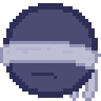
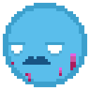
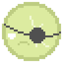
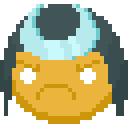

<!-- CheckImageSize -->
<!--suppress CheckImageSize -->
<div style="text-align: center;">    

#  KAPS! 

Un mini-jeu à la *'Dr. Mario'* dont j'aimerais bien faire une appli un de ces quatre.  
Déplace et matche les gélules de la grille afin de dégommer toutes les bactéries façon Pfizer ! 💊  
*(en vrai je laisse le README en français en attendant que ça devienne un vrai truc)*

[🎮 EH COMMENT ON LANCE LE JEU ??](#lancer-le-jeu-)  
[⌨ EH COMMENT ON JOUE ??????](#comment-jouer-)  
~  
[📜 EH C'EST QUOI LES RÈGLES (j'arrête)](#rgles-du-jeu-)  
[🤝 LES SIDEKICKS](#sidekicks-)  
[🦠 LES BACTÉRIES](#bactries-)  
[💊 GÉLULES SPÉCIALES](#glules-spciales-)   
~  
[💡 PETITS TIPS](#tips-)  
[🇬🇧 ENGLISH README](README_EN.md)


</div>

### UPDATES 🚨

*04/03/2022 :*
- 🤝 De nouveaux **sidekicks** ont été rajoutés !! J'ai aussi rajouté pas mal de **chara-design** aux persos et
je leur ai donné des noms **plus génériques**. C'était imprononçable... *[👉🏾 Voir les sidekicks !](#sidekicks-)*
- 🖱 On peut maintenant **naviguer dans le menu** et **jouer** **_AVEC LA SOURIS_** !!!!!! (rendant le jeu tactile pour potentielle une version mobile ! :D) *[👉🏾 Voir les contrôles](#comment-jouer-)*
- 💡 J'ai **ralenti** la cadence au début, mais augmenté **l'accélération**.  
     Et il y a un **faisceau lumineux** pour aider aussi maintenant. Si avec ça vous passez toujours pas le niveau 4... *(je vise personne !!!!)*

*23/02/2022 :*
- 🧭 J'ai mis un **menu de sélection** des sidekicks avant les niveaux 😏 *(c'est archi long à faire)*
- ➕ J'ai rajouté **5 niveaux au début** *parce qu'askip "c'était trop dur dès le début"*
- ➕ J'ai aussi rajouté une touche permettant de tourner des gélules **dans l'autre sens**  *(ça évite de devoir tourner 3 fois dans le même sens)*
- 📃 On peut maintenant voir les **stats** des sidekicks dans le **menu pause**.
- ➕ Il y a maintenant plus de **commandes** pour lancer le jeu (pour pouvoir lancer une série de niveaux précise avec une équipe de sidekicks précise) *(comment ça tu t'en fous)*
- ⚖ J'ai de ouf rééquilibré le pouvoir de certains sidekicks et leur mana (la jauge à remplir)
- 👁 Visuellement j'ai rendu le truc plus propre, y'a des petites animations au niveau de l'interface

##### CE QUI VA (SÛREMENT) BOUGER

- Des contrôles souris encore plus précis (directement bouger la capsule avec la souris, cliquer dessus pour tourner, etc.)
- Y'aura peut être un script `install` pour que le jeu soit moins lourd à télécharger
- un leaderboard ?

## LANCER LE JEU 🎮

⚠ Il faut avoir [**Java 11** or +](https://www.oracle.com/java/technologies/javase/jdk11-archive-downloads.html) d'installé sur ta machine, sinon rien se lancera :/

#### WINDOWS

- Clique sur `kaps.exe`

#### LINUX

- Lance le script `./kaps.sh`

... ou alors tu ouvres un terminal depuis le dossier source comme un grand, et tu lances:

```sh
> java -jar bin/kaps-demo.jar
```


## COMMENT JOUER 🕹

#### 💊 En partie
##### ⌨ CLAVIER
`⬅`, `➡` / `Q`, `D` : bouge la gélule à **gauche**/**droite**  
`⬆` / `Z` : **tourne** la gélule  
`⬇` / `S` : bouge la gélule en bas là, **en bas**  
`[SPACEBAR]` : fais **tomber** la gélule   
`🇭` : conserve la gélule dans **HOLD**  
✨**NOUV.** - `V` / `B` : tourne la gélule dans le sens **anti-horaire** 🔄 / 🔁 **horaire**

##### 🖱 SOURIS
✨**NOUV.** : **clique** et **drag** la souris depuis n'importe quel endroit de l'écran pour activer le joystick  
`CLIC`: **tourne** la gélule  
`JOYSTICK ⬅`, `➡`: bouge la gélule à **gauche**/**droite**  
`JOYSTICK ⬇`: bouge la gélule **EN BAS**

#### ⚙ General

`🇵` : mettre le jeu sur **pause**  
`Esc` : **quitter** le jeu

---

# RÈGLES DU JEU 📜

Fais bouger les gélules qui tombent au fur et à mesure dans la grille et réalise des matchs de **4 éléments ou +** de la même couleur pour les détruire.  
Les éléments détruits libèrent de la **mana✨**, qui remplissent la jauge des sidekicks de leur couleur. Une fois la jauge pleine, l'attaque du sidekick est déclenchée. 💥


Le niveau est fini lorsque toutes les bactéries de la grille ont été dégommées !
*(attention, elles ne subissent pas la gravité)*  
Fais gaffe par contre à ne pas faire déborder la grille, d'autant plus que le jeu va de plus en plus vite avec le temps.

## SIDEKICKS 🤜‍🤛

| Nom | | Mana | Dégâts | Pouvoir |  
|---:|:---:|:---:|:---:|:---|   
| (✨nouv.!) **SHADOW**   |      | 10 tours | 1 | Enlève toutes les gélules de sa propre couleur de la grille
| **SLICER**              |         | 20       | 1 | Découpe un élément, et tous les autres sur la même ligne
| **SHOCKWAVE**           |     | 20       | 2 | Frappe un élément, puis les cases adjacentes
| **BUTCHER**             |     | 20       | 2 | Découpe deux bactéries aux hasard
| **PAINTER**             |      | 10       |   | Repeins 8 gélules de la grille au hasard
| **UNI**                 |          | 4 tours  |   | Génère une gélules avec deux couleurs identiques
| (✨nouv.!) **CUTTER**   |      | 18       | 2     | Découpe deux segments de 3 cases, verticaux et horizontaux
| **MIMAPS**              |      | 15       | 2 | Brûle 3 éléments de la grille au hasard
| **BOMBER**              |      | 13 tours | 1 | Génère une gélules explosive
| (✨nouv.!) **SAMURAI**  |    | 15       | 1 | Découpe une diagonale, dans un sens au pif
| **SNIPER**              |      | 15       | 3 | Tire sur la bactérie qui a le plus de vie
| **MOSES**               |          | 25       | 2 | Découpe toute une colonne au hasard
| **MARKSMAN**            |    | 25       | 1 | Découpe deux diagonales
| (✨nouv.!) **SHUFFLER** |  | 8        |   | Repeint TOUTE la grille avec des couleurs au pif
| (✨nouv.!) **CROSS**    |        | 12       |   | Peins un "+" autour de l'objet le plus entouré
| **???** | *(Coming soon !)* | 12       |   | Freeze définitivement une bactérie avec un cooldown
| **???** | *(Coming soon !)* | 15       | 3 | Frappe 4 cases au hasard dans la partie basse de la grille

## BACTÉRIES 🦠

| Nom | | Cooldown | Pouvoir |  
|---:|:---:|:---:|:---|   
| **BASIC** |  | - | "ah gros on est là hein"
| **WALL**  |   | - | A besoin de plusieurs coups (4 max.) pour être détruit
| **VIRUS** |  | 8 | Transforme une gélule de la grille au hasard en virus
| **SPIKE** |  | 5 | Détruit une gélule adjacente au hasard
| **???**   | *(Coming soon !)* | 6 | Peut soigner un WALL (de 1PV), ou transformer une bactérie BASIC en WALL
| **???**   | *(Coming soon !)* | 6 | Échange de place avec la gélule la plus proche
| **???**   | *(Coming soon !)* | 6 | Change sa propre couleur. comme ça.
| **???**   | *(Coming soon !)* | 10 | Émet de la fumée devant un élément, masquant sa couleur. (peut être dissipé au contact, ou si l'émetteur est détruit)
| **???**   | *(Coming soon !)* | - | Protège une bactérie, et doit être détruit pour que la bactérie devienne atteignable.
| **???**   | *(Coming soon !)* | - | Pareil qu'au dessus, mais fais en sorte de masquer la couleur de la bactérie protégée.

## GÉLULES SPÉCIALES ✨💊

| Nom | | Effet |  
|---:|:---:|:---|   
| **EXPLOSIVE** |  | Explose quand elle est détruite, brûlant toutes les cases autour
| **JOKER**     | *(Coming soon !)* | Peut être matchée avec n'importe quelle autre couleur
| **???**       | ? | (Coming soon !)

---

### TIPS 💡

- Les matchs de **5 éléments ou +** génèrent du mana supplémentaire pour les sidekicks
- D'ailleurs, les matchs de 5 éléments ou + font plus de dégâts sur les WALLS que les matchs classiques
- Fume les **virus** en priorité. Ça peut vite être le bordel.
- N'oublie pas que le HOLD peut te sauver la vie.
- Le choix des sidekicks et leurs **synergies** peuvent être déterminants pour certains niveaux.
- Ah oui au fait ! On peut faire des matchs de carrés 3x3, qui rapportent vraiment pas mal de mana.
- Poser des gélules explosives près des SPIKES les font se suicider. C'est marrant


### COMMANDES ! ⌨

Pour mes bêta-testeurs **sûrs** qui lancent le jeu depuis un terminal 😏

```sh
> ... -l [lvl1] [lvl2] ...
```

Lance une séquence de niveaux (dont le numéro est précisé à la place de `lvl`).  
Par exemple, mettre `12` en guise de niveau lance le niveau 12.  
Mettre `?` en guise de niveau lance un niveau au hasard.  
Mettre `!` en guise de niveau génère une grille aléatoire !

```sh
> ... -s [name1] [name2] ...
```

Ajoute le sidekick de nom `name` à l'équipe. 🤝
*[Voir les sidekicks...](#sidekicks-)*  
Là aussi, `?` sélectionne un sidekick au hasard.